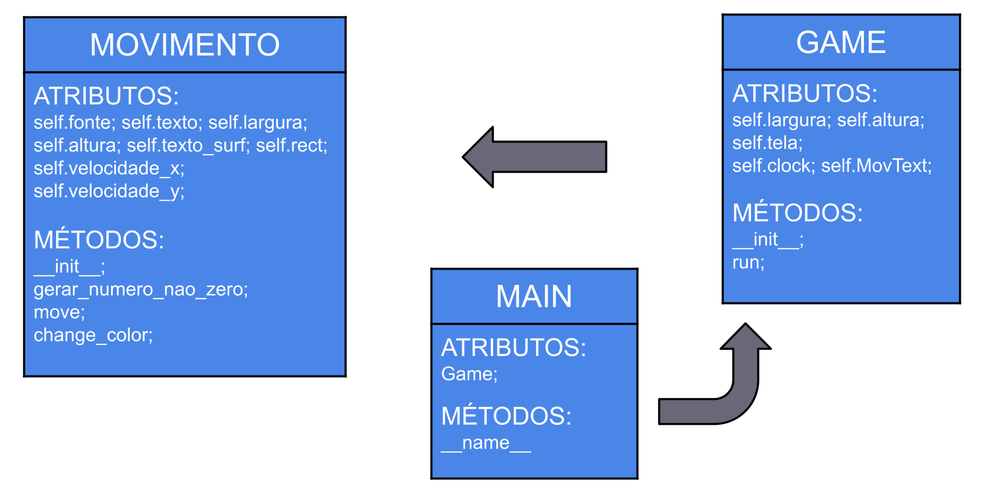

Projeto "Bate-Bate", baseado no famoso display de DVD que quando batia em qualquer direção, trocava de cor aleatoriamente.

Este projeto possui 3 partes, a Mecânica de Movimentos, Game e Main. Cada um desses elementos possui seus respectivos "Atributos" e "Métodos".

------------------------------------------------------

<h1>Estrutura das Mecânicas.<h1>

------------------------------------------------------

------------------------------------------------------

<h1>Classe Movendo Texto (mecmov).<h1>

a

------------------------------------------------------
